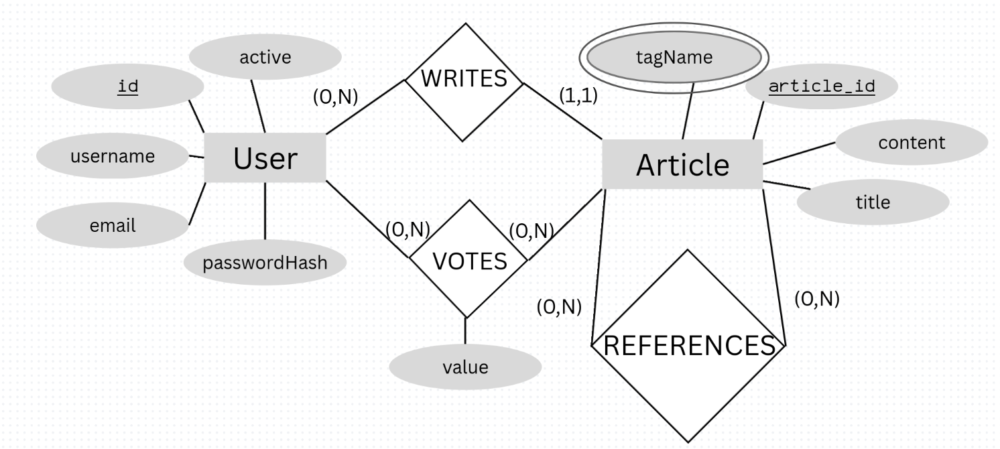

# DBS (IT-204) 2025 Odd Semester

## Group Members

1. Akash Kumar (2024IMT005)
2. Akshit Gandhi (2024IMT006)
3. Aman Dabral (2024IMT007)
4. Aman Kumar Singh (2024IMT008)
5. Aniket Vinod Shewale (2024IMT011)

## Project Description

The project is a web app designed for sharing authentic Articles. Users can read and write articles. They can list the refrences they used for an their article. Users can also upvote and downvote the articles to assist the community.

## Features

1. User Registration and Login
2. Article Creation
3. Article Reading
4. Article Referencing
6. Article Upvote/Downvote
6. Article Search  
    6.1. By Title  
    6.2. By Tags

## ER Diagram




## Database Schema

``` SQL
-- users table (for reference)
CREATE TABLE users (
    id VARCHAR(36) PRIMARY KEY,
    username VARCHAR(255) UNIQUE,
    email VARCHAR(255) UNIQUE,
    passwordHash VARCHAR(255),
    active BOOLEAN
);

-- articles table
CREATE TABLE articles (
    article_id VARCHAR(36) PRIMARY KEY,
    id VARCHAR(36) REFERENCES users(id) ON DELETE CASCADE,
    title VARCHAR(255) UNIQUE,
    content TEXT
);

-- references_table
CREATE TABLE references_table (
    article_id VARCHAR(36) REFERENCES articles(article_id) ON DELETE CASCADE,
    to_article_id VARCHAR(36) REFERENCES articles(article_id) ON DELETE CASCADE,
    PRIMARY KEY (article_id, to_article_id),
    CHECK (article_id <> to_article_id)
);

-- votes table
CREATE TABLE votes (
    article_id VARCHAR(36) REFERENCES articles(article_id) ON DELETE CASCADE,
    id VARCHAR(36) REFERENCES users(id) ON DELETE CASCADE,
    value BOOLEAN,
    PRIMARY KEY (article_id, id)
);

-- tags table
CREATE TABLE tags (
    article_id VARCHAR(36) REFERENCES articles(article_id) ON DELETE CASCADE,
    tagName VARCHAR(100),
    PRIMARY KEY (article_id, tagName)
);
```

## Technologies Used
1. Node.js
2. Express.js
3. MySQL
4. React.js
5. Tailwind CSS

## How to Run
1. Clone the repository
> git clone https://github.com/skyprincegamer/dbs_project
2. Install the dependencies in both frontend and backend folder.
> cd backend && npm install

> cd frontend && npm install
3. Fill in .env variables
4. Run the server (MYSQL, frontend and backend)
> cd backend && npm run dev

> cd frontend && npm run dev

5. Open the website in the browser
. Visit the website at http://localhost:5173